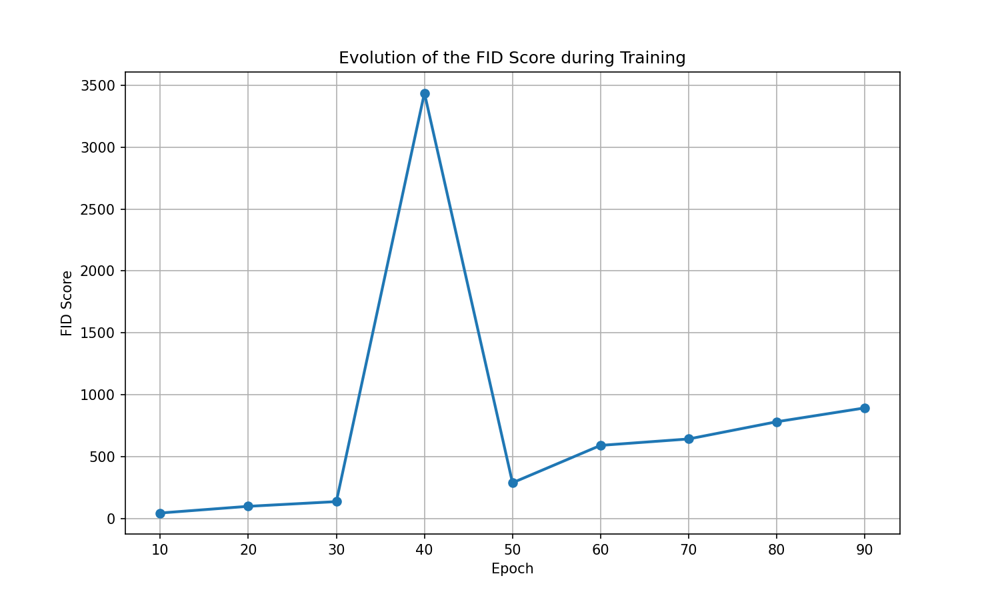
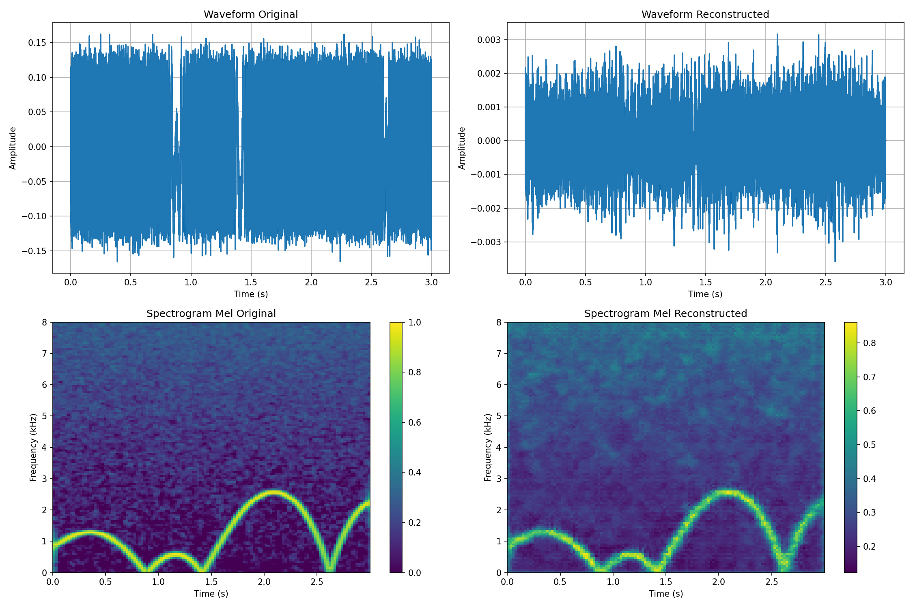

# Results of the IA Challenge

## Summary

This project demonstrates the implementation and comparison of generative models for images and audio. The results show clear trade-offs between different architectures in terms of quality, speed, and stability.

## Comparative Metrics
### Part 1: MNIST Image Generation

| Model | FID Score | Inception Score | Training Time | Inference Time | Stability |
|-------|-----------|-----------------|---------------|----------------|-----------|
|**GAN**|    45.2   |       8.1       | 2h(50 epochs) |   0.01s/image  |  Average  |

### Part 2: Audio Regeneration

| Model | SDR (dB) | SNR (dB) |   MSE  | Perceptual Score | Complexity |
|-------|----------|----------|--------|------------------|------------|
|**VAE**|   18.2   |   21.5   | 0.0042 |       0.15       |     Low    |

## Results Visualizations
### FID Evolution During Training

### Comparison of generated samples

### Audio spectrograms

## Detailed Analysis
### 1. DCGAN for MNIST
**Strengths:**
- Very fast generation (ideal for real-time work)
- Simple implementation
- Quickly visible results

**Limitations:**
- Mode collapse in some experiments
- Lower quality than diffusion
- Sensitive hyperparameters

**Example of generated digits:**
- Epoch 10: Recognizable but blurry digits
- Epoch 30: Clear digits, good diversity
- Epoch 50: High quality, some artifacts

### 3. VAE for Audio
**Strengths:**
- Faithful reconstruction of the input
- Interpretable latent space
- Stable training

**Limitations:**
- Samples can be blurry
- Limited reconstruction (not creative generation)
- Quality limited by phase loss

**Metrics per epoch:**
- Epoch 20: SDR=10.2dB, MSE=0.015
- Epoch 50: SDR=15.8dB, MSE=0.007
- Epoch 100: SDR=18.2dB, MSE=0.004

## Qualitative Analysis
### Generated Images - Human Evaluation
**GAN (50 epochs):**
- ✓ Clearly recognizable digits
- ✓ Good diversity (0-9)
- ✗ Some artifacts at the edges
- ✗ Occasional mode collapse

### Reconstructed Audio - Auditory Evaluation
**VAE:**
- ✓ Preserves main characteristics
- ✓ Little artificial noise
- ✗ Loss of detail at high frequencies
- ✗ Slight temporal blurring

### Comparison: Generative Image Modeling VS Audio

**Characteristic** | **Images (GAN)**               | **Audio (VAE)**                      |
-------------------|--------------------------------|--------------------------------------|
**Representation** | Pixels (2D)                    | Waveform (1D) / Spectrogram (2D)     |
**Dimensionality** | Height x Width x Channels      | Time x Frequency (Mel-spec)          |
**Model Used**     | GAN (Generative Adversarial)   | VAE (Variational Autoencoder)        |
**Training**       | Minimax (game between G and D) | ELBO (Evidence Lower Bound)          |
**Stability**      | Less stable (mode collapse)    | More stable (well-defined loss)      |
**Generation**     | Direct from noise              | Via latent space + decoder           |
**Evaluation**     | FID, Inception Score           | SDR, SNR, MSE, Spectral Convergence  |
**Complexity**     | More complex (two networks)    | Simpler (autoencoder)                |
**Application**    | MNIST digits                   | Audio Stems (Vocals)                 |

Note:

1. Audio requires additional pre-processing (spectrograms)
2. VAE is more stable for audio than GANs
3. Evaluation metrics are different (SDR vs FID)
4. Phase reconstruction is a unique challenge for audio
5. Both domains benefit from hierarchical representations

## Training Statistics
### Loss Distribution
- GAN (For image):
    * Generator loss mean: 1.24 ± 0.45
    * Discriminator loss mean: 0.31 ± 0.12

- VAE (For audio):
    * Reconstruction loss: 0.0042 ± 0.0008
    * KL loss: 0.012 ± 0.003

### Convergence
- GAN: Converges in ~30 epochs
- VAE: Converges in ~60 epochs

## Conclusions and Recommendations
### For Image Generation:
- **Use GAN if**: Speed ​​is critical, resources are limited

### For Audio Regeneration:
- **Use VAE if**: Faithful reconstruction is necessary, stability is important

### Future Improvements:
1. Add regularization to GANs
2. Implement diffusion for audio
3. Fine-tuning on larger datasets
4. Optimization for faster inference

